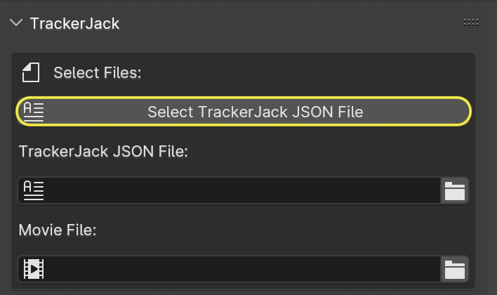
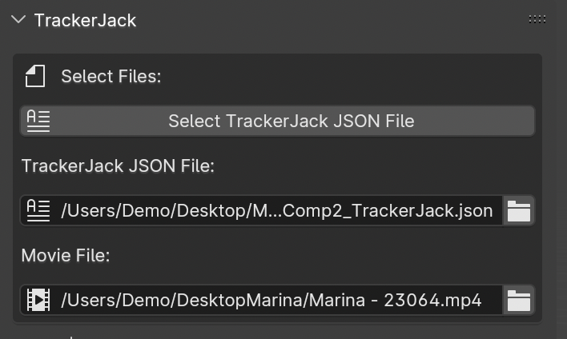

#####################################
Blender Panel Options
#####################################

|InstallBIPanel| the Blender Add-on and open Blender if you haven't already. The Blender panel is found in the 3D view 'n' panel.
This panel has many options and powerful features that are not avaiable thru the simpler method at *File > Import > TrackerJack AE Tracking Data(.json)*

.. image:: images/BPanelFull.png
    :alt: TrackerJack Blender Import Options
      
.. |InstallBIPanel| raw:: html

       <a href="https://trackerjack-tutorial.readthedocs.io/en/latest/installation.html#blender-add-on-install">Install</a>

======================================================
Select Files Panel
======================================================

Select TrackerJack JSON File button
^^^^^^^^^^^^^^^^^^^^^^^^^^^^^^^^^^^^^^^^^^

1. Click the **Select TrackerJack JSON File** button and locate the TrackerJack JSON file you exported from After Effects.

2. The **TrackerJack JSON file** and **Movie File** entry boxes should be display the correct filepaths.

.. tip::
    If the Movies File entry box is empty, Blender had a problem resolving the filepath. You can either use the file **button** to manually locate the movie file, or you can use the **Import Scene without Movie** button.

.. image:: images/BPanel_SelectFiles3.png
    :alt: Select Files Panel Error

======================================================
Import Options Panel
======================================================

Import Settings (Drop Down Choice)
^^^^^^^^^^^^^^^^^^^^^^^^^^^^^^^^^^^^^^^^^^
Import Settings has two options for how to import the After Effects items.

1. **Import AE Scene** - This is the default setting, to be used for the first import of a JSON file to set up your scene. It deletes everything in the scene, yes even that default mesh box, and imports the After Effects Tracked Scene.
   
2. **Add Additional Tracked Items** - Use this setting to update your scene with any with additional items you create in After Effects. This option is non-destructive, it adds new elements to the existing **World** Empty that is created after previously using **Import AE Scene**, because these new items are parented to the **World** they are already scaled and rotated.

.. image:: images/BPanel_ImportOpts1.png
    :alt: Import Type

Point Cloud
^^^^^^^^^^^^^^^^^^^^^^^^^^^^^^^^^^^^^^^^^^

The null layers in your After Effects file can be imported into Blender as vertices in a point cloud mesh, or as individual empty layers.
 
1. **Vertex** - This is the default setting, it is the fastest to import, and ready for modeling.
   
2. **Empty** - You may import each null as a Blender Empty, but it is considerably slower. It may take several minutes to complete.

.. image:: images/BPanel_ImportOpts2.png
        :alt: TrackerJack Import Pointcloud

Start Frame Adjust
^^^^^^^^^^^^^^^^^^^^^^^^^^^^^^^^^^^^^^^^^^

TrackerJack by default sets up the scene using the same start frame as your After Effects comp. However, depending on your source footage and workflow, the are times your After Effects comp might not start with frame 0. This results in your Blender scene being created later in your timeline. While you can change the start frame in the composition settings in After Effects before you export the JSON file with TrackerJack, you might find it easier to adjust where your footage begins in Blender by using this setting. 

**Enable** - If Checked start frame will be adjusted.
**Frame** - Enter the Frame Number in Blender where the scene should start.
**Movie Only** - Click Enable if you want to adjust the movie start independent of the tracked camera. (Uncommon for most uses)

        
 .. tip::
        After Effects compositions normally start at Frame 0, Blender timelines begin at Frame 1. TrackerJack adjusts all start frames from 0 to 1 automatically. However, if the After Effects composition begins after frame 1, TrackerJack makes no adjustment. (Unless you use the Frame Adjust option).

Setup Compositor
^^^^^^^^^^^^^^^^^^^^^^^^^^^^^^^^^^^^^^^^^^

This setting is enabled by defaut. TrackerJack creates a very simple Compositor setup so you're ready to render your created items with the background footage. Leaving this checkbox unchecked will skip this setup.

**Enable** - If checked the compositor will be enabled.  If unchecked the compositor will not be enabled.

.. image:: images/BPanelCompositor.png
    :alt: TrackerJack Import Compositior Setup
        

Import Scene Button
^^^^^^^^^^^^^^^^^^^^^^^^^^^^^^^^^^^^^^^^^^

• The button is disabled and appears as **Select Files First** until a TrackerJack JSON file has been selected in the **Select Files** panel.
• The button is enabled and appears as **Import Scene without Movie** when a TrackerJack JSON filepath is verified but the **Movie File** is missing. You can proceed and import all tracked items and camera without the movie, or use the **Movie File** button to locate the movie.
• The button is enabled and appears as **Import Scene** when both the TrackerJack JSON filepath and Movie filepath are verified.

.. image:: images/BPanelImportScene.png
    :alt: TrackerJack Import Scene Button

Reset Scene Button
^^^^^^^^^^^^^^^^^^^^^^^^^^^^^^^^^^^^^^^^^^

Sometimes, you may import a scene, then decide to make changes such as **Adjust Start Frame** the **Reset Scene - Delete Everything** button is a quick way of deleting all items in the scene and any orphaned data.

======================================================
Scene Options Panel
======================================================

======================================================
Help Panel
======================================================
