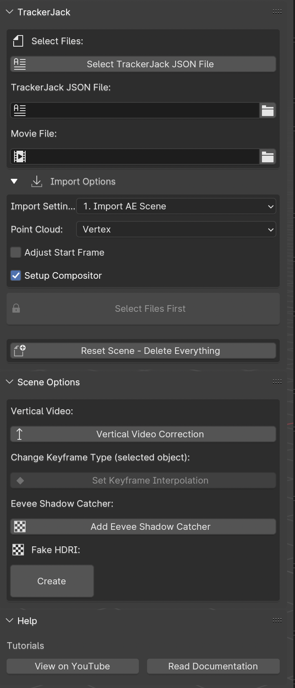
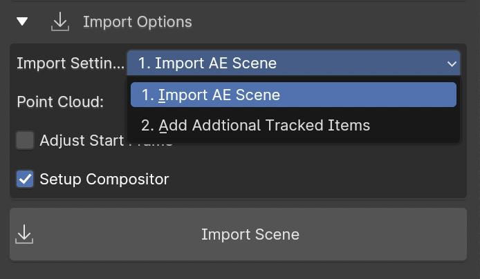
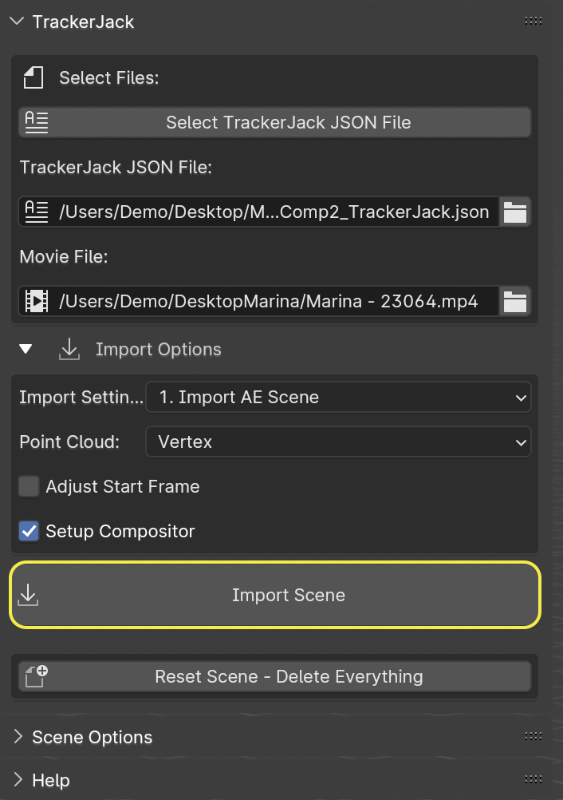
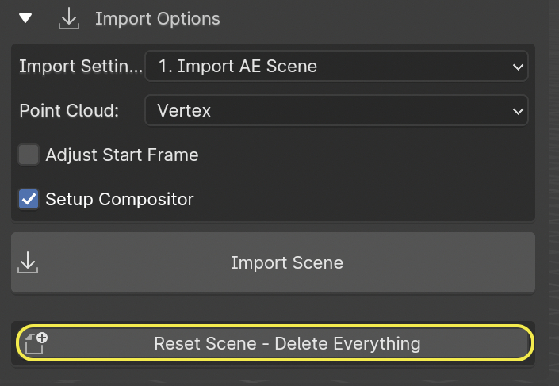

#####################################
Blender Panel Options
#####################################

|InstallBIPanel| the Blender Add-on and open Blender if you haven't already. The Blender panel is found in the 3D view 'n' panel.
This panel has many options and powerful features that are not avaiable thru the simpler method at *File > Import > TrackerJack AE Tracking Data(.json)*

      
.. |InstallBIPanel| raw:: html

       <a href="https://trackerjack-tutorial.readthedocs.io/en/latest/installation.html#blender-add-on-install">Install</a>

======================================================
Select Files Panel
======================================================

Select TrackerJack JSON File button
^^^^^^^^^^^^^^^^^^^^^^^^^^^^^^^^^^^^^^^^^^

1. Click the **Select TrackerJack JSON File** button and locate the TrackerJack JSON file you exported from After Effects.

    .. image:: images/BPanel_SelectFilesbutton.png
        :alt: Select Files Button

2. The **TrackerJack JSON file** and **Movie File** entry boxes should be display the correct filepaths.

    .. image:: images/BPanel_SelectFiles2.png
        :alt: Select Files Filepaths

.. tip::
    If the Movies File entry box is empty, Blender had a problem resolving the filepath. You can either use the file **button** to manually locate the movie file, or you can use the **Import Scene without Movie** button.

.. image:: images/BPanel_SelectFiles3.png
    :alt: Select Files Panel Error

======================================================
Import Options Panel
======================================================

Import Settings (Drop Down Choice)
^^^^^^^^^^^^^^^^^^^^^^^^^^^^^^^^^^^^^^^^^^
Import Settings has two options for how to import the After Effects items.

1. **Import AE Scene** - This is the default setting, to be used for the first import of a JSON file to set up your scene. It deletes everything in the scene, yes even that default mesh box, and imports the After Effects Tracked Scene.
   
2. **Add Additional Tracked Items** - Use this setting to update your scene with any with additional items you create in After Effects. This option is non-destructive, it adds new elements to the existing **World** Empty that is created after previously using **Import AE Scene**, because these new items are parented to the **World** they are already scaled and rotated.

Point Cloud
^^^^^^^^^^^^^^^^^^^^^^^^^^^^^^^^^^^^^^^^^^

The null layers in your After Effects file can be imported into Blender as vertices in a point cloud mesh, or as individual empty layers.
 
1. **Vertex** - This is the default setting, it is the fastest to import, and ready for modeling.
   
2. **Empty** - You may import each null as a Blender Empty, but it is considerably slower. It may take several minutes to complete.

Start Frame Adjust
^^^^^^^^^^^^^^^^^^^^^^^^^^^^^^^^^^^^^^^^^^

TrackerJack by default sets up the scene using the same start frame as your After Effects comp. However, depending on your source footage and workflow, the are times your After Effects comp might not start with frame 0. This results in your Blender scene being created later in your timeline. While you can change the start frame in the composition settings in After Effects before you export the JSON file with TrackerJack, you might find it easier to adjust where your footage begins in Blender by using this setting. 

**Enable** - If Checked start frame will be adjusted.
**Frame** - Enter the Frame Number in Blender where the scene should start.
**Movie Only** - Click Enable if you want to adjust the movie start independent of the tracked camera. (Uncommon for most uses)

.. image:: images/BPanel_ImportOpts3.png
    :alt: Start Frame Adjust
        
 .. tip::
        After Effects compositions normally start at Frame 0, Blender timelines begin at Frame 1. TrackerJack adjusts all start frames from 0 to 1 automatically. However, if the After Effects composition begins after frame 1, TrackerJack makes no adjustment. (Unless you use the Frame Adjust option).

Setup Compositor
^^^^^^^^^^^^^^^^^^^^^^^^^^^^^^^^^^^^^^^^^^

This setting is enabled by default. TrackerJack creates a very simple Compositor setup so you're ready to render your created items with the background footage. Leaving this checkbox unchecked will skip this setup.

**Enable** - If checked the compositor will be enabled.  If unchecked the compositor will not be enabled.

.. image:: images/BPanelCompositor.png
    :alt: Compositior Setup
        

Import Scene Button
^^^^^^^^^^^^^^^^^^^^^^^^^^^^^^^^^^^^^^^^^^

• The button is disabled and appears as **Select Files First** until a TrackerJack JSON file has been selected in the **Select Files** panel.
• The button is enabled and appears as **Import Scene without Movie** when a TrackerJack JSON filepath is verified but the **Movie File** is missing. You can proceed and import all tracked items and camera without the movie, or use the **Movie File** button to locate the movie.
• The button is enabled and appears as **Import Scene** when both the TrackerJack JSON filepath and Movie filepath are verified.

Reset Scene Button
^^^^^^^^^^^^^^^^^^^^^^^^^^^^^^^^^^^^^^^^^^

Sometimes, you may import a scene, then decide to make changes such as **Adjust Start Frame** the **Reset Scene - Delete Everything** button is a quick way of deleting all items in the scene and any orphaned data.

======================================================
Scene Options Panel
======================================================

The **Scene Options** panel contains several extras and bonus features that you can use after you've imported your scene to improve and adjust it.

Vertical Video Correction
^^^^^^^^^^^^^^^^^^^^^^^^^^^^^^^^^^^^^^^^^^
TrackerJack Supports the import and use of vertical or portrait orientation video. However some footage (primarily taken on smartphones) is recorded in horizontal orientation and encoded with a 90˚ rotation in the metadata. After Effects reads this and automatically interprets the footage as vertical, Blender does not. After you **Import Scene** with vertical video with this issue, when you Press '0' to switch to the Camera view, or go to View -> Cameras -> Active Camera and press spacebar to play the timeline and update the scene, you will notice a problem with the background video.

• Click the **Vertical Video Correction** button and the video will automatically be rotated to match your scene.

.. image:: images/BlenderVerticalVideo.gif
    :alt: Vertical Video Button

Set KeyFrame Interpolation
^^^^^^^^^^^^^^^^^^^^^^^^^^^^^^^^^^^^^^^^^^
When you import After Effects layers that have postion and orientation key frame animation, TrackerJack automatically uses Linear interpolation for those key frames. 

• You can change this to any other interpolation that Blender supports by selecting the layer then clicking the **Set Keyframe Interpolation** button. 

    .. image:: images/BlenderKeyFrameInterpolation.png
        :alt: Interpolation 1

• A pop up menu will appear and you can apply the new interpolation mode.

    .. image:: images/BlenderKeyFrameInterpolation2.png
        :alt: Interpolation options

 .. tip::
        When using easing or any complex animation in After Effects, it's better to use the **Bake All Frames** option in the |After Effects TrackerJack Settings Panel| to create keys for every frame of animation. 

.. |After Effects TrackerJack Settings Panel| raw:: html

       <a href="https://trackerjack-tutorial.readthedocs.io/en/latest/panel_options.rst#frame-export-drop-down-choice">After Effects TrackerJack Settings Panel</a>

Add Eevee Shadow Catcher
^^^^^^^^^^^^^^^^^^^^^^^^^^^^^^^^^^^^^^^^^^
The **Eevee Shadow Catcher** is a bonus feature. There are two ways to use it. 

• Any solid layer that you rename "Shadow" in After Effects before exporting, will automatically have the "ShadowCatcher" material appplied to the layer when it is imported into Blender.

• Select a mesh layer in your scene. In Object mode click the **Add Eevee Shadow Catcher** button. The "ShadowCatcher" material will be appplied.

The "ShadowCatcher" material may require adjusting the **Color Ramp** and **Subtract** nodes in the **Shader Editor** in order to match your scene. 

.. image:: images/BlenderShadowCatcherAdjust.png
    :alt: ShadowCatcher Adjust

.. tip::
        See the Eevee Shadow Catcher chapter in the quick start video |here|.
    
        .. |here| raw:: html
        
           <a href="https://youtu.be/btiEqsJ1q_E&t=677" target="_blank">here</a>

Fake HDRI button
^^^^^^^^^^^^^^^^^^^^^^^^^^^^^^^^^^^^^^^^^^
This isn't true HDRI lighting. But it can give suprisingly good results. If you don't have a HDRI of the footage location the **Fake HDRI** button will use your footage as an Equirectangular Image texture on the World shader.

    .. image:: images/BlenderFakeHDRISetup.png
        :alt: Fake HDRI button

• Click the **Fake HDRI** button

    .. image:: images/BlenderFakeHDRI.png
        :alt: Fake HDRI button

• The Frame and Rotation controls allow you to match the background to your scene. They also can be keyframed.

    .. image:: images/BlenderFakeHDRI2.png
        :alt: Fake HDRI button

    .. image:: images/FakeHDRI.gif
        :alt: Fake HDRI Process

.. tip::
        See the Fake HDRI chapter in the quick start video |HDRIVideo|.
    
        .. |HDRIVideo| raw:: html

           <a href="https://youtu.be/btiEqsJ1q_E&t=717" target="_blank">here</a>

======================================================
Help panel
======================================================

The Help panel has a link to the Quick Start Video and to this online Documentation.

