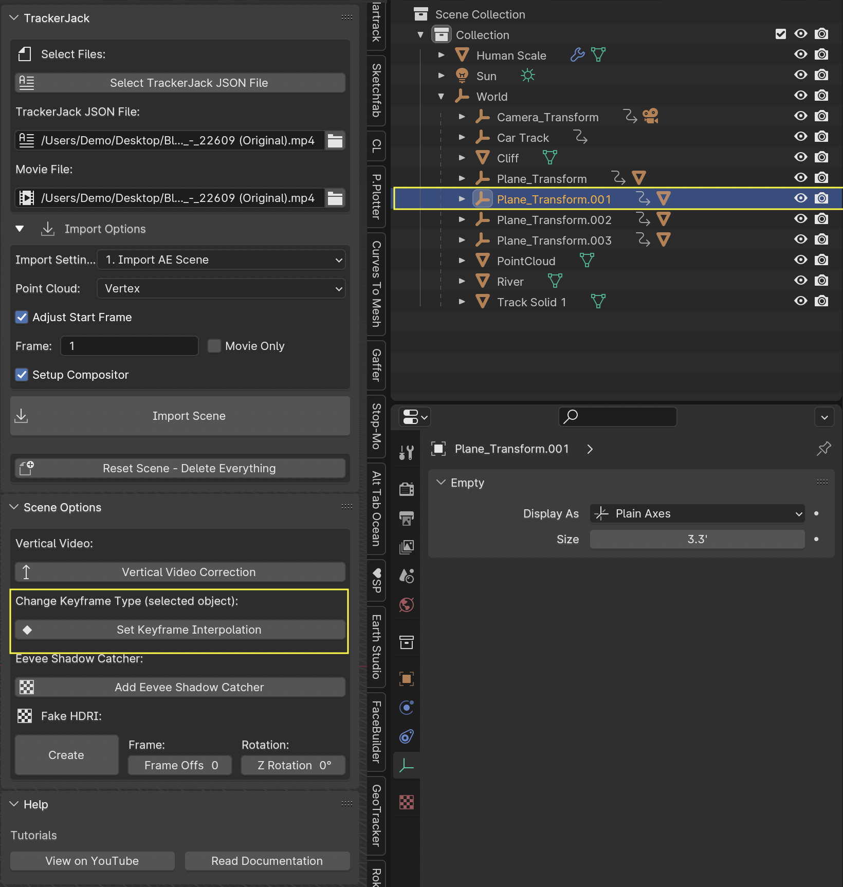
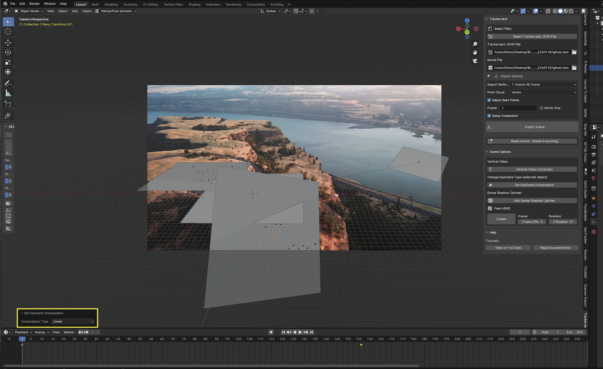
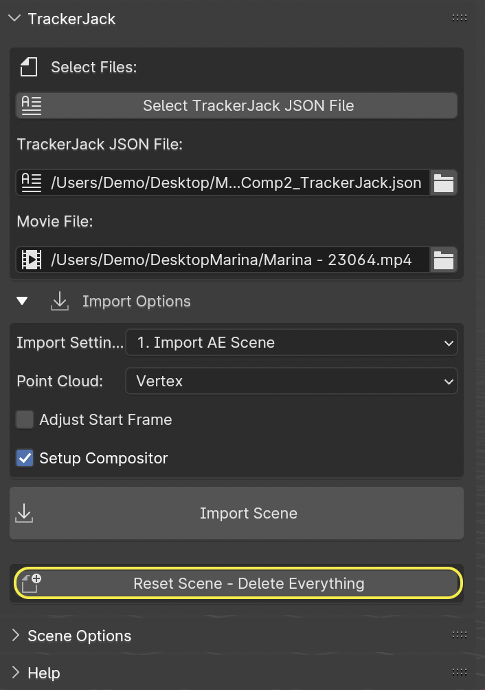

#####################################
Bonus Features
#####################################

Speed and Ease of use
^^^^^^^^^^^^^^^^^^^^^^^^^^^^^^^^^^^^^^^^^^
TrackerJack was designed to quickly import a 3D Camera Tracked Movie into Blender that could be scaled and aligned with ease. Allowing you to spend your time modeling and rendering. Since it's initial release more features have been added with the idea of saving time, and allowing you to quickly render quality scenes. 

Fexible workflow
^^^^^^^^^^^^^^^^^^^^^^^^^^^^^^^^^^^^^^^^^^
One important feature that was part of TrackerJack's design from the start is the ability, to track and export from After Effects, import and work in Blender, then decide that more tracker points or solids are needed and be able to go back to After Effects, create more layers and update the existing Blender scene without having to start over.

Animated Layers
^^^^^^^^^^^^^^^^^^^^^^^^^^^^^^^^^^^^^^^^^^
Begining with TrackerJack 2.0 - animated nulls and solids are transferred with their position and orientation animation intact. You can motion track a object in your movie, attact the tracker to a null and have it brought into your 3D Blender scene and to replace with a 3D model.

.. tip::
        TrackerJack does not layer animation that is based on expressions, it must be keyframed. If you have a layer that uses expressions for position, orientation, or rotation make sure to select the layer then use the After Effects command *Animation > Keyframe Assitant > Convert Expression to Keyframes* to convert the layer before exporting with TrackerJack. 

    .. image:: images/AEExpressionAnimation.png
        :alt: Expression Animation

    .. image:: images/AEKeyframeAnimation.png
        :alt: Keyframe Animation

Setup Compositor
^^^^^^^^^^^^^^^^^^^^^^^^^^^^^^^^^^^^^^^^^^

Enabled by default in the Blender TrackerJack Import panel this creates a very simple Compositor setup so you're ready to render your created items with the background footage. Leaving this checkbox unchecked will skip this setup.

    .. image:: images/BPanelCompositor.png
        :alt: TrackerJack Import Compositior Setup
        

Eevee Shadow Catcher
^^^^^^^^^^^^^^^^^^^^^^^^^^^^^^^^^^^^^^^^^^
The **Eevee Shadow Catcher** is a bonus feature. There are two ways to use it. 

• Any solid layer that you rename "Shadow" in After Effects before exporting, will automatically have the "ShadowCatcher" material appplied to the layer when it is imported into Blender.

• Select a mesh layer in your scene. In Object mode click the **Add Eevee Shadow Catcher** button. The "ShadowCatcher" material will be appplied.

The "ShadowCatcher" material may require adjusting the **Color Ramp** and **Subtract** nodes in the **Shader Editor** in order to match your scene. 

.. image:: images/BlenderShadowCatcherAdjust.png
    :alt: ShadowCatcher Adjust

.. tip::
        See the Eevee Shadow Catcher chapter in the quick start video |here|.
    
        .. |here| raw:: html
        
           <a href="https://youtu.be/btiEqsJ1q_E&t=677" target="_blank">here</a>

Vertical Video Correction
^^^^^^^^^^^^^^^^^^^^^^^^^^^^^^^^^^^^^^^^^^
TrackerJack Supports the import and use of vertical or portrait orientation video. However some footage (primarily taken on smartphones) is recorded in horizontal orientation and encoded with a 90˚ rotation in the metadata. After Effects reads this and automatically interprets the footage as vertical, Blender does not. After you **Import Scene** with vertical video with this issue, when you Press '0' to switch to the Camera view, or go to View -> Cameras -> Active Camera and press spacebar to play the timeline and update the scene, you will notice a problem with the background video.

• Click the **Vertical Video Correction** button and the video will automatically be rotated to match your scene.

.. image:: images/BlenderVerticalVideo.gif
    :alt: Vertical Video Button

Set KeyFrame Interpolation
^^^^^^^^^^^^^^^^^^^^^^^^^^^^^^^^^^^^^^^^^^
When you import After Effects layers that have postion and orientation key frame animation, TrackerJack automatically uses Linear interpolation for those key frames. 

• You can change this to any other interpolation that Blender supports by selecting the layer then clicking the **Set Keyframe Interpolation** button. 

• A pop up menu will appear and you can apply the new interpolation mode.

 .. tip::
        When using easing or any complex animation in After Effects, it's better to use the **Bake All Frames** option in the |After Effects TrackerJack Settings Panel| to create keys for every frame of animation. 

.. |After Effects TrackerJack Settings Panel| raw:: html

       <a href="https://trackerjack-tutorial.readthedocs.io/en/latest/panel_options.rst#frame-export-drop-down-choice">After Effects TrackerJack Settings Panel</a>

Reset Scene Button
^^^^^^^^^^^^^^^^^^^^^^^^^^^^^^^^^^^^^^^^^^

Sometimes, you may import a scene, then decide to make changes such as **Adjust Start Frame** the **Reset Scene - Delete Everything** button is a quick way of deleting all items in the scene and any orphaned data.

