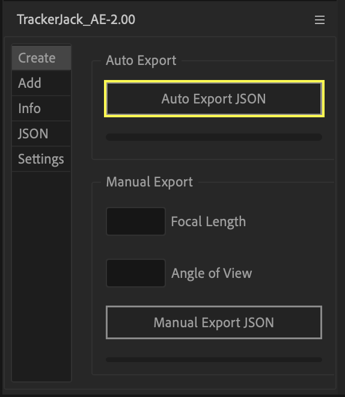
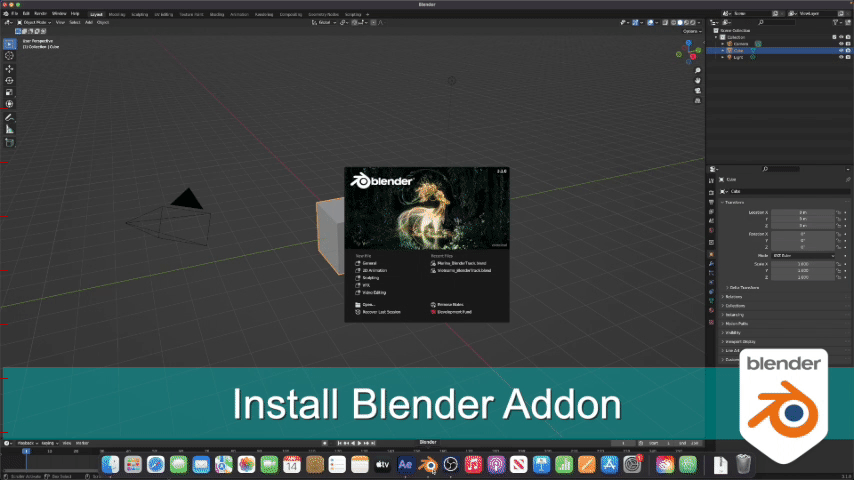
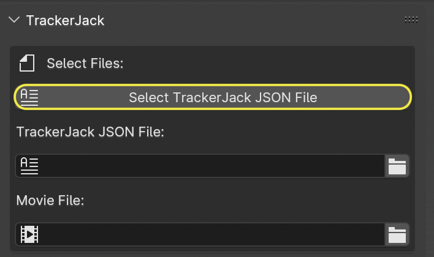
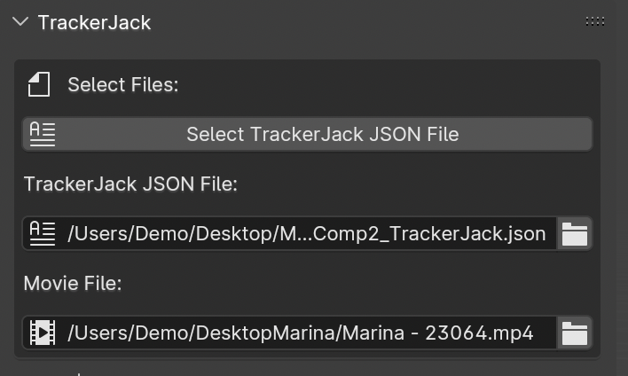
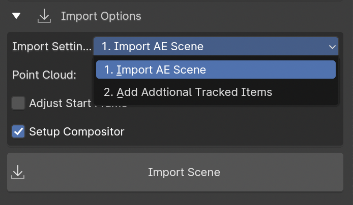
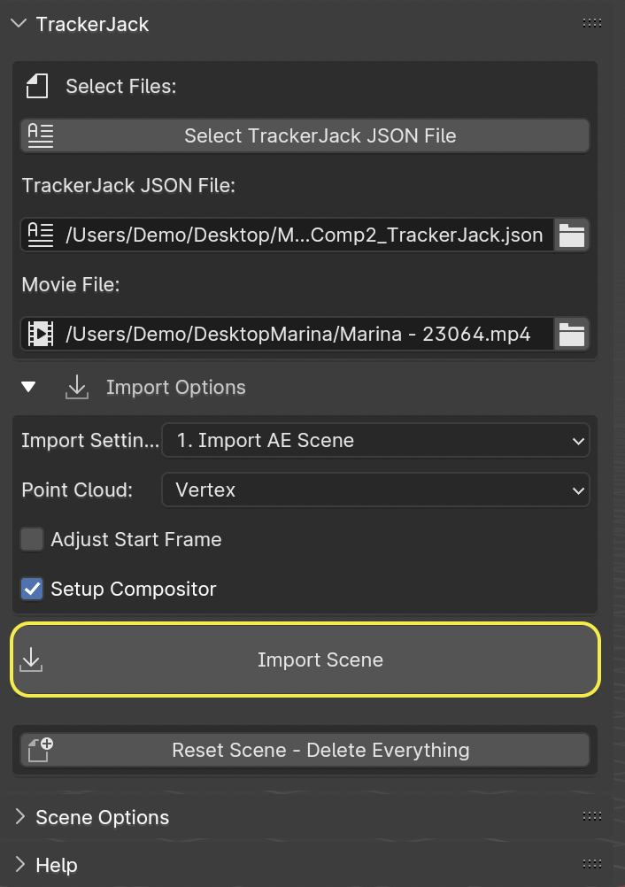
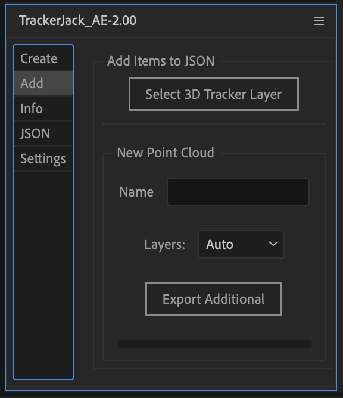
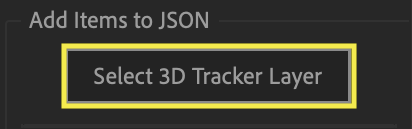
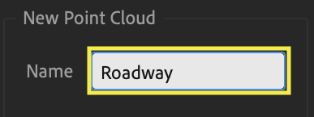
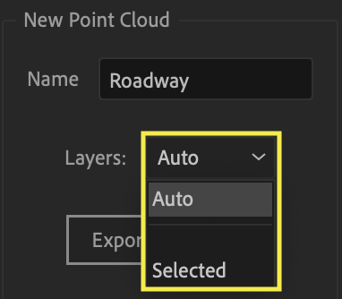

#####################################
Quick Start
#####################################

Watch the full quick start video |here|.

   .. |here| raw:: html
   
      <a href="https://youtu.be/btiEqsJ1q_E" target="_blank">here</a>
   
======================================================
After Effects
======================================================

Install After Effects Effects Panel
------------------------------------------
1.|Install| TrackerJack_AE-2.00.jsxbin to your After Effects ScriptUI Panels folder and if you haven't already.  *(path_to_After_Effects_Applicaiton_folder) > Scripts > ScriptUI Panels* 
   
   .. |Install| raw:: html
   
      <a href="https://trackerjack-tutorial.readthedocs.io/en/latest/installation.html#after-effects-panel-install">Install</a>
   
2. Open After Effects, and launch the TrackerJack Panel via the Windows Menu (Windows > TrackerJack_AE-2.00.jsxbin)
   
3. Open After Effects Preferences and make sure that "Allow scripts to write files and access network" is enabled.

.. image:: images/AE01-Install.gif
  :alt: Install AE Panel
        
Add footage and Track
------------------------------------------

1. Add footage and create a composition.
   
2. Use Effects > 3D Camera Tracker on the footage layer in your composition.

.. image:: images/AE02-Import.gif
  :alt: Import and Track Footage
        
3. Select tracked points and create elements

   \a)Select points and right click to create Origin and Ground
      
   \b)Right click to create Solid and Camera.
      
   \c)select additional points to create additional nulls and solids as desired.

.. image:: images/AE03-AddItems.gif
  :alt: Add AE Items
        

Export with TrackerJack
------------------------------------------

Under the Create tab you have two options - Auto Export and Manual Export. 

Auto Export is the default and easiest way to export your project data from After Effects to a JSON file that the Blender TrackerJack add-on will import. 

Manual Export exists as a backup in case of the unlikely instance where Auto Export fails.

Auto Export
^^^^^^^^^^^^^^^^^^^^^^^^^^^^^^^^^^^^^^^^^^

\a) Make sure to save your After Effects Project into a folder. By default this is where your JSON file is saved. 

\b) In the **Create** tab click the **Auto Export JSON** button.

The alert confirms the filepath of the exported file.

Manual Export
^^^^^^^^^^^^^^^^^^^^^^^^^^^^^^^^^^^^^^^^^^

\a) Enter the Camera information on the TrackerJack panel. Camera Settings units must be millimeters.
      
\b) Save the After Effects file.
      
\c) Click the **Manual Export JSON** button on the TrackerJack Panel
   
.. image:: images/AE04-Export.gif
  :alt: Manual Export JSON

======================================================
Blender
======================================================

Install the Blender Addon
------------------------------------------

|InstallBIPanel| the Blender Add-on and open Blender if you haven't already. The Blender panel is found in the 3D view 'n' panel.
This panel has many options and powerful features that are not avaiable thru the simpler method at *File > Import > TrackerJack AE Tracking Data(.json)*

.. |InstallBIPanel| raw:: html

   <a href="https://trackerjack-tutorial.readthedocs.io/en/latest/#installation.html#blender-add-on-install">Install</a>

Import JSON and Adjust Scene
------------------------------------------

Import the JSON file into Blender
^^^^^^^^^^^^^^^^^^^^^^^^^^^^^^^^^^^^^^^^^^

1. Click the **Select TrackerJack JSON File** button and locate the TrackerJack JSON file you exported from After Effects.

2. The **TrackerJack JSON file** and **Movie File** entry boxes should be display the correct filepaths.

3. Under **Import Settings** make sure the option ****Import AE Scene** is selected.

.. tip::
    If the Movies File entry box is empty, Blender had a problem resolving the filepath. You can either use the file **button** to manually locate the movie file, or you can use the **Import Scene without Movie** button.

    .. image:: images/BPanel_SelectFiles3.png
        :alt: Select Files Panel Error

4. Click the **Import Scene** button.

        
Scale and Rotate the World
^^^^^^^^^^^^^^^^^^^^^^^^^^^^^^^^^^^^^^^^^^

1. Press '0' to switch to the Camera view, or go to *View* -> *Cameras* -> *Active Camera*.
2. Press Spacebar to play the timeline (Advancing frames)
  will update the scene if your pointclould doesn't seem to be aligned.
3. Select the "World" empty in the Scene Outiner
4. Press 's' and adjust the scale so the "Human Scale" mesh matches the scale for your scene.
5. Press 'r' then 'z' and adjust the z rotation so the grid matches your scene.

 .. image:: images/BL02-ScaleandRotate.gif
     :alt: Scale and Rotate the World

======================================================
Adding Additional Items
======================================================

Once you begin modeling your scene in Blender, you may require addtional pointclouds or planes to build out your scene. It is easy to go back to After Effects and create additional layers, append the orginal JSON file, and import them into your Blender scene while maintaining the world scale and rotation you have already set. Each time you click **Export Additional** button the file is updated.

After Effects - add more
------------------------------------------

• Use the **Add** tab in the TrackerJack panel to add additional items to an existing JSON file.

Activate the Track points
^^^^^^^^^^^^^^^^^^^^^^^^^^^^^^^^^^^^^^^^^^

• Clicking the button **Select 3D Tracker Layer** button which selects the movie layer and then selects the 3D Tracker Effect, activating the track points for selection.

Create more null and solid layers
^^^^^^^^^^^^^^^^^^^^^^^^^^^^^^^^^^^^^^^^^^

• Once the track points are active you can |select and create new nulls and or solids| in your composition.

.. image:: images/SelectItems.gif
     :alt: Add Pointcloud Name

.. |select and create new nulls and or solids| raw:: html

   <a href="https://trackerjack-tutorial.readthedocs.io/en/latest/quick_start.rst#select-tracked-points-and-create-elements">select and create new nulls and or solids</a>

Name the new pointcloud
^^^^^^^^^^^^^^^^^^^^^^^^^^^^^^^^^^^^^^^^^^

• Enter a name for the new point cloud (new null layers) in the **Name** entry box.
       

Layers ( Drop down choice )
^^^^^^^^^^^^^^^^^^^^^^^^^^^^^^^^^^^^^^^^^^

* Auto - will export any new layers since the last export

* Selected - will export the layers manually selected in the timeline

Export Additional button
^^^^^^^^^^^^^^^^^^^^^^^^^^^^^^^^^^^^^^^^^^

• Click the **Export Additional** button to update the existing JSON file.

.. image:: images/AEPanelAdd4.png
  :alt: Export Additional Button

.. tip::
        You can continue to create additional null layers, name them, and then click Export Additional repeatedly if you want to create more named pointcloud layers before returning to Blender.

Blender - import more
------------------------------------------
.. tip::
        Always save your Blender file before updating.

Verify Filepaths and Settings
^^^^^^^^^^^^^^^^^^^^^^^^^^^^^^^^^^^^^^^^^^
• In the **Select Files** section of the TrackerJack Blender Paenl make sure the **TrackerJack JSON file** and **Movie File** entry boxes display the correct filepaths.

• If they are empty click the **Select TrackerJack JSON File** button and locate the TrackerJack JSON file you exported from After Effects.

Under **Import Settings** make sure the option ****2. Add Additional Tracked Items** is the option selected.

Update Scene
^^^^^^^^^^^^^^^^^^^^^^^^^^^^^^^^^^^^^^^^^^
• Click the **Import Scene** button.

 

