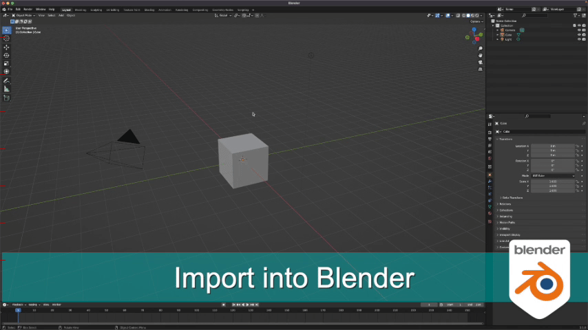
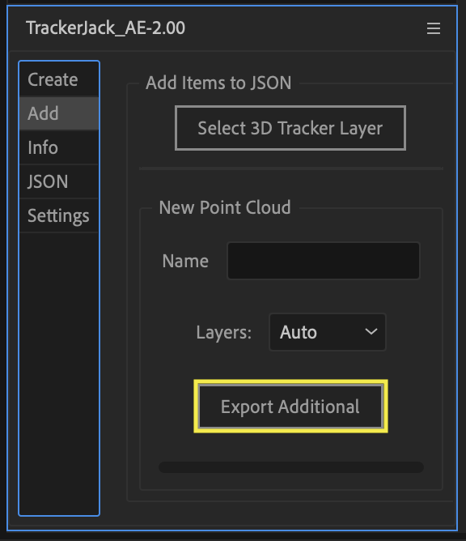

#####################################
Quick Start
#####################################

|Video Link|

.. |Video Link| raw:: html

   <a href="https://youtu.be/btiEqsJ1q_E" target="_blank">Video Link</a>
   
======================================================
After Effects
======================================================

Install After Effects Effects Panel
------------------------------------------
1.|Install| TrackerJack_AE-2.00.jsxbin to your After Effects ScriptUI Panels folder and if you haven't already.  (After Effects > Scripts > ScriptUI Panels) 
   
.. |Install| raw:: html

   <a href="https://trackerjack-tutorial.readthedocs.io/en/latest/installation.html#after-effects-panel-install">Install</a>
   
2. Open After Effects, and launch the TrackerJack Panel via the Windows Menu (Windows > TrackerJack_AE-2.00.jsxbin)
   
3. Open After Effects Preferences and make sure that "Allow scripts to write files and access network" is enabled.

 .. image:: images/AE01-Install.gif
     :alt: Install AE Panel
        
Add footage and Track
------------------------------------------

1. Add footage and create a composition.
   
2. Use Effects > 3D Camera Tracker on the footage layer in your composition.

 .. image:: images/AE02-Import.gif
     :alt: Import and Track Footage
        
3. Select tracked points and create elements

   \a)Select points and right click to create Origin and Ground
      
   \b)Right click to create Solid and Camera.
      
   \c)select additional points to create additional nulls and solids as desired.

.. image:: images/AE03-AddItems.gif
  :alt: Add AE Items
        

Export with TrackerJack
------------------------------------------

Under the Create tab you have two options - Auto Export and Manual Export. 

Auto Export is the default and easiest way to export your project data from After Effects to a JSON file that the Blender TrackerJack add-on will import. 

Manual Export exists as a backup in case of the unlikely instance where Auto Export fails.

Auto Export
^^^^^^^^^^^^^^^^^^^^^^^^^^^^^^^^^^^^^^^^^^

\a) Make sure to save your After Effects Project into a folder. By default this is where your JSON file is saved. 

\b) In the **Create** tab click the **Auto Export JSON** button.

.. image:: images/AEAutoBut.png
     :alt: Auto Export JSON

The alert confirms the filepath of the exported file.

Manual Export
^^^^^^^^^^^^^^^^^^^^^^^^^^^^^^^^^^^^^^^^^^

\a) Enter the Camera information on the TrackerJack panel. Camera Settings units must be millimeters.
      
\b) Save the After Effects file.
      
\c) Click the **Manual Export JSON** button on the TrackerJack Panel
   
 .. image:: images/AE04-Export.gif
     :alt: Manual Export JSON

======================================================
Blender
======================================================

|Install the Addon| if you haven't already
------------------------------------------

.. |Install the Addon| raw:: html

   <a href="https://trackerjack-tutorial.readthedocs.io/en/latest/installation.html#Blender-Add-on-install-install">Install the Addon</a>

* Open Blender and Install.
* Locate the TrackerJack zip file
* Enable the check box to activate the add-on

Import the JSON data into Blender
------------------------------------------

* Press 'a' to select all, then press 'x' and click the *Delete* button to clear the default elements.
* Go to the File menu and select *TrackerJack AE Tracking Data (.json)* listed by selecting the import command.
* Locate and select the JSON file exported from After Effects. (Adjust settings of panel or use default settings)

        
Scale and Rotate the World
------------------------------------------

* Press '0' to switch to the Camera view, or go to *View* -> *Cameras* -> *Active Camera*.
* Press Spacebar to play the timeline (Advancing frames)
  will update the scene if your pointclould doesn't seem to be aligned.
* Select the "World" empty in the Scene Outiner
* Press 's' and adjust the scale so the "Human Scale" mesh matches the scale for your scene.
* Press 'r' then 'z' and adjust the z rotation so the grid matches your scene.

 .. image:: images/BL02-ScaleandRotate.gif
     :alt: Scale and Rotate the World

======================================================
Adding Additional Items
======================================================

Once you begin modeling your scene in Blender, you may require addtional pointclouds or planes to build out your scene. It is easy to go back to After Effects and create additional layers, append the orginal JSON file, and import them into your Blender scene while maintaining the world scale and rotation you have already set. Each time you click **Export Additional** button the file is updated.

After Effects - add more
------------------------------------------

Use the **Add** tab in the TrackerJack panel to add additional items to an existing JSON file.

Activate the Track points
^^^^^^^^^^^^^^^^^^^^^^^^^^^^^^^^^^^^^^^^^^

Clicking the button **Select 3D Tracker Layer** button which selects the movie layer and then selects the 3D Tracker Effect, activating the track points for selection.

Create more null and solid layers
^^^^^^^^^^^^^^^^^^^^^^^^^^^^^^^^^^^^^^^^^^

Once the track points are active you can |select and create new nulls and or solids| in your composition.

.. image:: images/SelectItems.gif
  :alt: Add Pointcloud Name

.. |select and create new nulls and or solids| raw:: html

   <a href="https://trackerjack-tutorial.readthedocs.io/en/latest/quick_start.rst#select-tracked-points-and-create-elements"select and create new nulls and or solids</a>

Name the new pointcloud
^^^^^^^^^^^^^^^^^^^^^^^^^^^^^^^^^^^^^^^^^^

Enter a name for the new point cloud (new null layers) in the **Name** entry box.
       

Layers ( Drop down choice )
^^^^^^^^^^^^^^^^^^^^^^^^^^^^^^^^^^^^^^^^^^

* Auto - will export any new layers since the last export

* Selected - will export the layers manually selected in the timeline

Export Additional button
^^^^^^^^^^^^^^^^^^^^^^^^^^^^^^^^^^^^^^^^^^

Click the **Export Additional** button to update the existing JSON file.

.. tip::
        You can continue to create additional null layers, name them, and then click Export Additional repeatedly if you want to create more named pointcloud layers before returning to Blender.

Blender - import more
------------------------------------------

   * Go to the File menu and select *TrackerJack AE Tracking Data (.json)* listed by selecting the import command.
   * In the options panel (press 'n' if necessary) select *Option 2 Add Additional Items*
   * Click the *Import* button
   
    .. image:: images/BL04-AdditionalItemsBlender.gif
        :alt: Scale and Rotate the World
